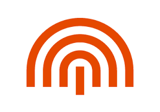

# 情報工学科の紹介

情報工学科は三つのコースに分かれています。
#1. システムエンジニアリングコース
 _プログラミングによって時代の求める新しい情報システムを作る_
 * プログラミングを基礎から学び、自在にコンピュータを制御するソフトウェアや情報システムの設計技術を修得していきます
#2. インターネット＆セキュリティコース
 _安全で安心できる持続的な情報社会を支えるネットワークとセキュリティを学ぶ_
 * 私たちの暮らしを守り、安全で安心できる情報社会を構築するために、ネットワーク技術や情報セキュリティ対策などについて学びます。

#3.知能情報コース
_「モノ」と「コト」の未来へAIの先を拓く_
* ビッグデータ解析や人工知能の知識・技術を基礎から応用まで学び、目覚しく変化する情報社会の新しい今後を創り出す専門家の育成を目指します。
https://feng.takushoku-u.ac.jp/course/cs/introduction.html
こちらから是非見てみてください:+1:

||人数
|---|---|----|
|学生|314|
|留学生|14

<!-- この部分より上に記述を追加して下のチェックボックスで確認する -->
- [ ] 2種類以上の見出し(headers)を使っている．
- [ ] 2種類以上の強調(emphasis)を使っている．
- [ ] (番号付きの)リスト(ordered lists)を使っている
- [ ] (番号無しの)リスト(unordered lists)を使っている．
- [ ] 1つ以上の画像(images)を使っている．
- [ ] 1つ以上のリンク(links)を使っている．
- [ ] 1つ以上の表(tables)を使っている．
- [ ] 1つ以上の絵文字を使っている．
